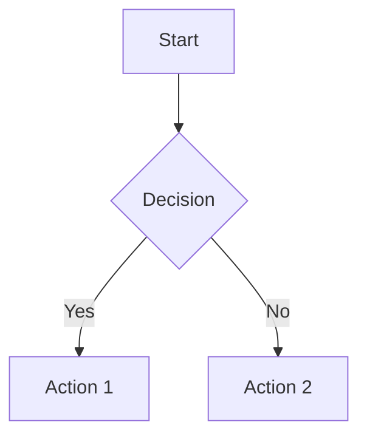

# Obsidian Markdown Syntax Reference

This document provides a comprehensive reference for Obsidian-flavored Markdown syntax.

## Basic Formatting

### Headings
```markdown
# Heading 1
## Heading 2
### Heading 3
#### Heading 4
##### Heading 5
###### Heading 6
```

### Text Formatting
```markdown
**Bold text**
*Italic text*
~~Strikethrough text~~
==Highlighted text==
**Bold text and _nested italic_ text**
***Bold and italic text***
```

### Inline Code
```markdown
Text inside `backticks` on a line will be formatted like code.
If you want to put backticks in an inline code block: inline `code with a backtick ` inside`.
```

### Code Blocks
````markdown
```
Basic code block
```

```python
# Syntax highlighted code block
def hello():
    print("Hello, World!")
```
````

## Lists

### Unordered Lists
```markdown
- First list item
- Second list item
- Third list item
```

Can also use `*` or `+` instead of `-`.

### Ordered Lists
```markdown
1. First list item
2. Second list item
3. Third list item
```

Can also use `)` instead of `.`:
```markdown
1) First list item
2) Second list item
```

### Task Lists
```markdown
- [x] Completed task
- [ ] Incomplete task
- [?] Optional task marker
- [-] Cancelled task marker
```

### Nested Lists
```markdown
1. First list item
   1. Ordered nested list item
2. Second list item
   - Unordered nested list item

- [ ] Task item 1
	- [ ] Subtask 1
- [ ] Task item 2
	- [ ] Subtask 1
```

## Links

### Internal Links (Wikilinks)
```markdown
[[Three laws of motion]]
[[Three Laws of Motion#First Law]]  # Link to heading
[[Three Laws of Motion|Newton's Laws]]  # Link with custom display text
```

### Markdown Links
```markdown
[Three laws of motion](Three%20laws%20of%20motion.md)
[Obsidian Help](https://help.obsidian.md)
```

### Obsidian URI Links
```markdown
[Note](obsidian://open?vault=MainVault&file=Note.md)
[My Note](obsidian://open?vault=MainVault&file=My%20Note.md)
[My Note](<obsidian://open?vault=MainVault&file=My Note.md>)
```

## Embeds

### Embed Notes
```markdown
![[Internal links]]  # Embed entire note
![[Internal links#^b15695]]  # Embed specific block
```

### Embed Images
```markdown
![[Engelbart.jpg]]
![[Engelbart.jpg|100x145]]  # With dimensions
![[Engelbart.jpg|100]]  # Width only (maintains aspect ratio)
```

### External Images
```markdown


```

## Callouts

Callouts are created by starting a blockquote with `[!type]`:

```markdown
> [!info]
> This is an info callout.

> [!warning]
> This is a warning callout.

> [!error]
> This is an error callout.

> [!todo]
> This is a todo callout.

> [!done]
> This is a done callout.

> [!important]
> This is an important callout.

> [!note]
> This is a note callout.
```

### Callout with Title
```markdown
> [!info] Custom Title
> This callout has a custom title.
```

### Foldable Callouts
```markdown
> [!info]- Collapsed by default
> This content is hidden initially.

> [!info]+ Expanded by default
> This content is visible initially.
```

## Blockquotes

```markdown
> Human beings face ever more complex and urgent problems.
>
> - Doug Engelbart, 1961
```

## Horizontal Rules

```markdown
---
***
___
```

## Comments

```markdown
This is an %%inline%% comment.

%%
This is a block comment.
Block comments can span multiple lines.
%%
```

## Footnotes

```markdown
This is a simple footnote[^1].

[^1]: This is the referenced text.

You can also use inline footnotes. ^[This is an inline footnote.]

Named footnotes[^note] are also supported.

[^note]: Named footnotes still appear as numbers, but can make it easier to identify references.
```

Multi-line footnotes:
```markdown
[^2]: Add 2 spaces at the start of each new line.
  This lets you write footnotes that span multiple lines.
```

## YAML Frontmatter (Properties)

```markdown
---
title: My Note Title
tags:
  - tag1
  - tag2
aliases:
  - Alternative Name
  - Another Alias
date: 2024-01-15
status: draft
author: Your Name
---
```

### Common Property Types

```markdown
---
# Text
title: Simple text value

# Number
count: 42
price: 19.99

# Boolean (Checkbox)
completed: true
archived: false

# Date
created: 2024-01-15
due: 2024-03-01

# DateTime
created_at: 2024-01-15T14:30:00

# List
tags: [tag1, tag2, tag3]
keywords:
  - keyword1
  - keyword2

# Links
link: "[[Another Note]]"
links:
  - "[[Note 1]]"
  - "[[Note 2]]"
---
```

## Tables

```markdown
| Header 1 | Header 2 | Header 3 |
| -------- | -------- | -------- |
| Cell 1   | Cell 2   | Cell 3   |
| Cell 4   | Cell 5   | Cell 6   |
```

Alignment:
```markdown
| Left | Center | Right |
| :--- | :----: | ----: |
| A    | B      | C     |
```

## Escaping

Use backslash `\` to escape special characters:

```markdown
\*This text will not be italicized\*
\**This line will not be bold**
\# This won't be a heading
1\. This won't be a list item
```

## Line Breaks

```markdown
line one
line two

line three
line four
(two trailing spaces create a line break)

line five

line six
(blank line creates a paragraph break)
```

## Mermaid Diagrams

````markdown

````

## Obsidian-Specific Features

### Search Queries

```markdown
meeting work
meeting OR work
meeting -work
"star wars"
file:.jpg
path:"Daily notes/2024"
tag:#work
[status:Draft OR Published]
```

### Slides

Use `---` to separate slides:

```markdown
# Slide 1

Content for slide 1

---

# Slide 2

Content for slide 2
```

## Best Practices

1. **Blank lines between elements**: Always use blank lines to separate different Markdown blocks (headings, paragraphs, lists, code blocks).

```markdown
# Heading 1

This is a paragraph.

- List item 1
- List item 2

Another paragraph.
```

2. **Consistent list markers**: Stick to one list marker style throughout a document (prefer `-` for unordered lists).

3. **Proper link encoding**: URL-encode spaces and special characters in links, or use angle brackets for paths with spaces.

4. **Avoid overusing formatting**: Use bold, italic, and highlighting sparingly for maximum impact.

5. **Use wikilinks for internal references**: Prefer `[[Note Name]]` over Markdown links for internal notes to leverage Obsidian's graph and linking features.
